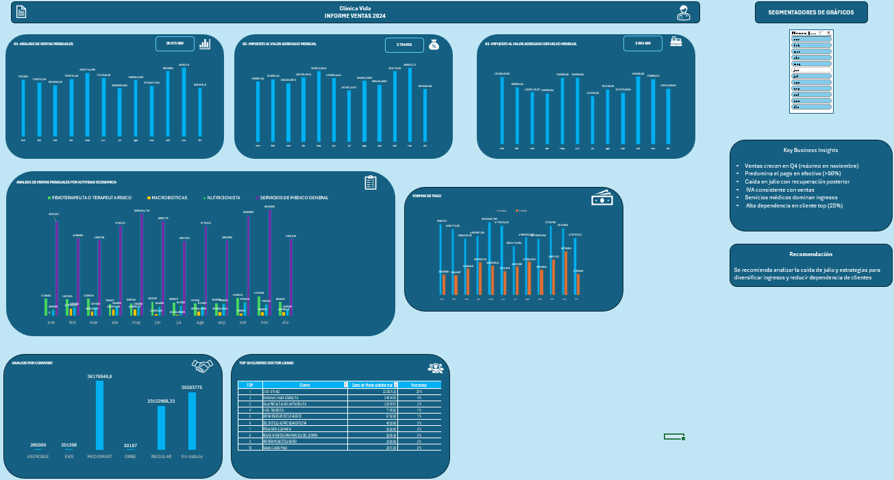

# Healthcare Financial Performance Analysis (Excel Dashboard)
End-to-end analysis of a healthcare center’s financial performance using Excel dashboards and business insights.

## Business Problem
Analyze the financial performance of a healthcare center to identify revenue trends, payment behavior, and key business risks.

## Tools Used
- Microsoft Excel  
- Pivot Tables  
- Data Analysis  

## Key KPIs
- Total Revenue  
- Monthly Sales Trend  
- Revenue by Payment Method  
- Top Clients Contribution  

## Key Business Insights
- Sales increase toward Q4, peaking in November  
- Cash payments dominate transactions (>50%)  
- Significant drop in July with recovery afterward  
- VAT trends align with revenue, ensuring data consistency  
- Medical services are the primary revenue source  
- High dependency on top client (~25% of revenue)  

## Recommendations
- Investigate the causes of the mid-year revenue drop  
- Diversify payment methods  
- Reduce dependency on top clients  

## Dataset
The dataset is anonymized and not included due to confidentiality.

## Dashboard Preview

